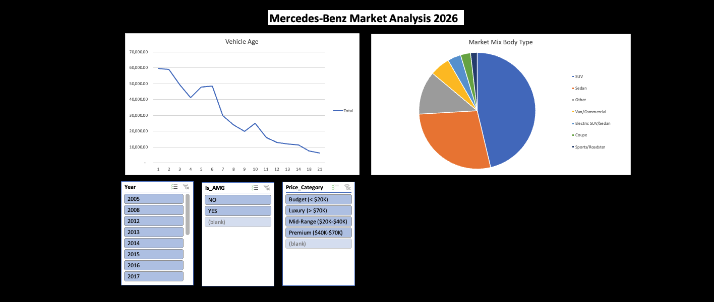

# Mercedes-Benz Market Analysis 2026 

### Project Overview
A comprehensive data analysis project using Excel to explore the Mercedes-Benz car market. The goal is to extract actionable insights for buyers and investors.

### Key Insights
* **Price Depreciation:** Significant value drop after the 2nd year, stabilizing after the 7th year.
* **Market Mix:** SUVs dominate the listings (46%), followed by Sedans.
* **Brand Premium:** AMG models maintain a price nearly 2x higher than standard models.
* **Efficiency Metric:** Created a "Price Per Mile" custom field to identify the best value deals.

### Tools Used
* Excel (Pivot Tables, Power Query, Slicers).
* Data Visualization & Dashboard Design.

---

### نظرة عامة على المشروع
مشروع تحليل بيانات شامل لسوق سيارات مرسيدس بنز باستخدام برنامج Excel، بهدف استخراج رؤى تساعد في اتخاذ قرارات شراء ذكية مبنية على الأرقام.

### أبرز الرؤى المستخرجة
* **انهيار الأسعار:** تنخفض القيمة بحدة بعد السنة الثانية وتستقر نسبياً بعد السنة السابعة.
* **هيكل السوق:** فئة الـ SUV تسيطر على المعروض بنسبة 46%.
* **قوة العلامة:** موديلات AMG تحتفظ بضعف قيمة الموديلات العادية تقريباً.
* **معيار الكفاءة:** ابتكار عمود "سعر الميل الواحد" لتحديد أفضل الصفقات اقتصادياً.

### الأدوات المستخدمة
* Excel (الجداول المحورية، الزراير التفاعلية Slicers).
* تصميم لوحات التحكم (Dashboards).

---

## Screenshots / لقطات الشاشة

